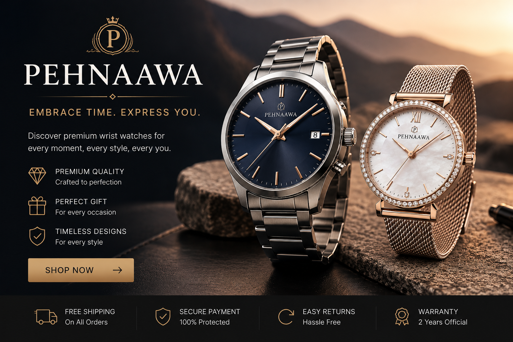
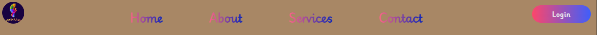
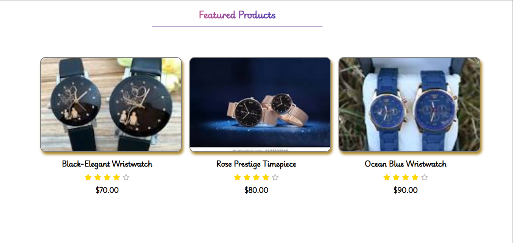
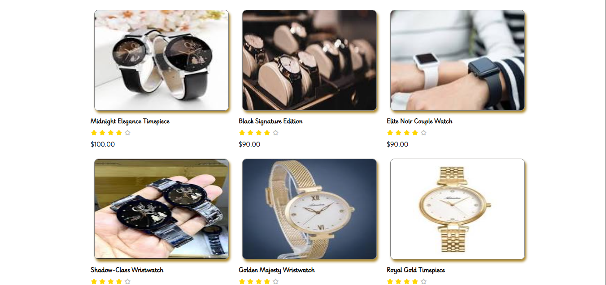
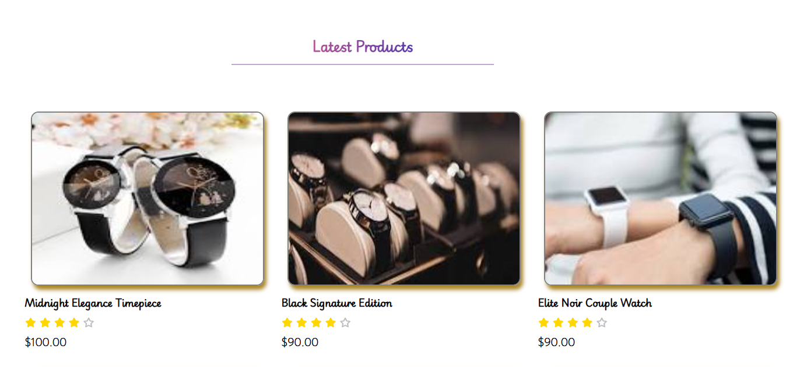
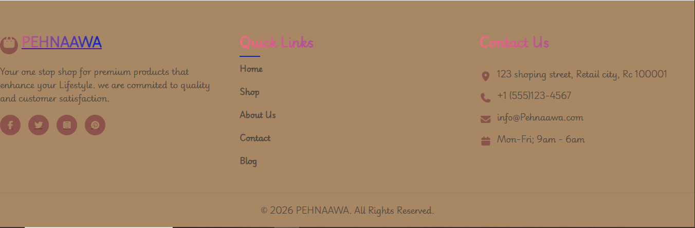

# 🌟 PEHNAAWA — Premium Couple Wristwatch E-Commerce Website

> ## ⌚ “Where Elegance Meets Timeless Style”
>
> A beautifully designed fashion e-commerce website focused on **luxury couple wristwatches**, combining modern UI design, elegant gradients, responsive layouts, stylish hover effects, and premium product presentation.

---

# 🖼️ Hero Section Introduction Place

```md


# ⌚ Welcome to PEHNAAWA
Discover timeless luxury watches crafted for modern elegance and unforgettable moments.
```

---


# 🎥 YouTube Video Showcase Place

```md
## 🎬 Website Preview Video

[Watch the Full Website Showcase on YouTube](https://youtu.be/I0fBVtzfOuE)
```

---

# 🧠 Project Overview

This project is a complete **front-end fashion e-commerce website** built using:

* 🎨 **HTML5**
* ✨ **CSS3**
* 🌈 Modern Gradient UI Design
* 📱 Responsive Grid Layouts
* 🛍️ Product Showcase Sections
* ⭐ Interactive Hover Effects
* 🧩 Professional Footer Design

The website presents luxury wristwatches in a stylish and user-friendly layout that feels like a real premium online brand.

---

# 🏗️ WEBSITE STRUCTURE EXPLANATION

---

# 🧭 1. Navigation Bar (Navbar)

## ✨ Purpose

The Navbar is the **main top navigation section** of the website.
It helps users move easily between pages such as:

* 🏠 Home
* ℹ️ About
* 🛠️ Services
* 📞 Contact

---



## 🔥 Features Used

### ✅ Flexbox Layout

```css
display: flex;
justify-content: space-between;
```

### 💡 Functionality

Flexbox aligns:

* Logo on the left
* Navigation links in the center
* Login button on the right

This creates a clean and professional structure.

---

## 🖼️ Logo Styling

```css
nav img {
    width: 50px;
    height: 50px;
    border-radius: 50px;
}
```

### ✨ Why It’s Important

* Keeps logo perfectly circular
* Creates a premium brand appearance
* Improves visual identity

---

## 🎨 Gradient Navigation Links

```css
background: linear-gradient(90deg, #FD6585 0%, #0D25B9 100%);
-webkit-background-clip: text;
color: transparent;
```

### 🌈 Functionality

This creates:

* Beautiful gradient-colored text
* Modern luxury appearance
* Eye-catching navigation style

---

## 🖱️ Hover Effects

```css
a:hover {
    box-shadow: 10px 10px 20px 10px rgba(64, 6, 131, 0.35);
}
```

### ✨ User Experience Benefit

When users hover:

* Links glow beautifully
* Website feels interactive
* UI becomes more premium

---

# 🦸 2. Hero Section

## 🎯 Purpose

The Hero Section is the **first visual impression** of the website.

```html
<section>
    
</section>
```

---

## ✨ Features

### 🖼️ Full Width Banner

```css
width: 100%;
height: 500px;
background-size: cover;
```

### 💡 Functionality

This ensures:

* Large cinematic appearance
* Professional fashion-brand feel
* Strong customer attraction

---

# ⭐ 3. Featured Products Section

## 🎯 Purpose

This section highlights the **best premium products**.

```html
<div class="featured-grid">
```



---

# 🧩 CSS Grid System

```css
display: grid;
grid-template-columns: repeat(3, 1fr);
```

---

## 💡 Functionality

Creates:

* 3-column product layout
* Clean spacing
* Organized product presentation

---

## 📱 Responsive Design

```css
@media (max-width: 900px)
```

### ✨ Why This Matters

The website automatically adapts to:

* 💻 Desktop
* 📱 Mobile
* 📲 Tablets

This is extremely important for real-world e-commerce websites.

---

# 🛍️ Product Cards

Each product card contains:

* 🖼️ Product Image
* ⌚ Product Name
* ⭐ Rating Stars
* 💲 Price

---



## ✨ Product Hover Animation

```css
transform: scale(1.03);
filter: grayscale(1);
```

### 🎯 Effect

When users hover:

* Product slightly zooms
* Image becomes grayscale
* Creates luxury-fashion interaction

---

# ⭐ Rating System

```html
<i class="fa-solid fa-star"></i>
```

---

## 💡 Purpose

Used to visually display:

* Customer trust
* Product popularity
* Premium quality

---

# 🛒 4. Latest Products Section

## 🎯 Purpose

Displays newly added wristwatches.

```html
<div class="latestProducts">
```



---

## ✨ Design Features

### 🌈 Gradient Text Heading

```css
background: linear-gradient(...)
```

### 💡 Functionality

Makes section titles:

* Stylish
* Modern
* Luxury-inspired

---

# 🧱 5. Main Products Grid

## 🎯 Purpose

This is the **main shopping showcase section**.

```html
<div class="all-products">
```

---

# 🧩 Grid Layout System

```css
grid-template-columns: repeat(3, 1fr);
```

### ✨ Result

Products display in:

* Structured rows
* Balanced spacing
* Professional product catalog style

---

# ⌚ Product Naming Strategy

Examples:

* 🌑 Midnight Elegance Timepiece
* 👑 Golden Majesty Wristwatch
* 🌊 Ocean Blue Wristwatch
* 💎 Platinum Shine Timepiece

---

## 💡 Why These Names Matter

These names create:

* Emotional luxury branding
* Premium customer perception
* Fashion-industry feel

This is extremely important in e-commerce branding psychology.

---

# 🎨 6. Typography & Font Styling

```css
font-family: "Playwrite GB S", cursive;
```

---

## ✨ Purpose

Creates:

* Elegant appearance
* Stylish luxury identity
* Modern fashion aesthetics

---

# 🌈 7. Gradient Design System

The website heavily uses gradients:

```css
linear-gradient(90deg, #FD6585 0%, #0D25B9 100%)
```

---

## 💡 Why Gradients Are Powerful

Gradients:

* Make UI visually rich
* Increase premium appearance
* Create modern web aesthetics

Used in:

* Navbar links
* Headings
* Buttons
* Footer titles

---

# 🔘 8. Login Button Design

```css
nav button {
    border-radius: 20px;
}
```

---

## ✨ Features

* Rounded corners
* Gradient background
* Hover shadow animation

### 🎯 Result

Creates a modern luxury button design.

---

# 🧾 9. Footer Section

## 🎯 Purpose

The footer provides:

* 🏢 Brand identity
* 🔗 Quick navigation links
* 📞 Contact information
* 🌐 Social media icons

---



# 🏷️ Footer Branding

```html
PEHNAAWA
```

### ✨ Brand Feel

The footer creates:

* Professional trust
* Fashion-brand identity
* Strong visual ending

---

# 🌐 Social Media Icons

```html
<i class="fa-brands fa-facebook-f"></i>
```

---

## ✨ Functionality

Social icons help users:

* Connect with the brand
* Visit social platforms
* Increase brand engagement

---

# 📞 Contact Information Section

Includes:

* 📍 Address
* ☎️ Phone Number
* 📧 Email
* 📅 Working Hours

---

# 🎨 Footer Hover Effects

```css
.social-links a:hover {
    background-color: #FD6585;
}
```

### 💡 Result

Creates:

* Interactive experience
* Smooth UI feedback
* Modern animation feel

---

# 📱 10. Responsive Design System

## 🎯 Purpose

The website is mobile-friendly.

```css
@media (max-width: 600px)
```

---

## ✨ Functionality

Automatically adjusts:

* Grid columns
* Product alignment
* Layout spacing

This ensures excellent user experience on all devices.

---

# 🚀 Advanced Front-End Concepts Used

| Feature         | Purpose              |
| --------------- | -------------------- |
| Flexbox         | Layout alignment     |
| CSS Grid        | Product organization |
| Media Queries   | Responsive design    |
| Hover Effects   | User interaction     |
| Gradients       | Modern aesthetics    |
| Box Shadow      | Depth & luxury feel  |
| Transform Scale | Smooth animations    |
| Border Radius   | Soft modern UI       |
| Font Styling    | Brand identity       |

---

# 💎 Why This Website Looks Professional

## 🌟 Because It Uses:

* Modern UI principles
* Consistent spacing
* Premium typography
* Elegant color palettes
* Interactive hover animations
* Responsive layouts
* Luxury product branding

---

# 🧠 Front-End Development Learning Outcome

By building this project, I practiced:

* ✅ Real-world HTML structure
* ✅ CSS Flexbox
* ✅ CSS Grid
* ✅ Responsive Design
* ✅ Hover Animations
* ✅ Gradient Styling
* ✅ E-Commerce Layout Building
* ✅ Professional UI Design

---

# 🎯 Final Impression

> ## ⌚ PEHNAAWA is not just a simple website…
>
> It represents a complete luxury fashion e-commerce experience built with elegant front-end development techniques.

✨ The combination of:

* modern gradients,
* responsive grids,
* premium product naming,
* hover animations,
* and structured UI design

creates a highly attractive and professional shopping experience.

---

# 🏆 Future Improvements Ideas (INSHALLAH)


* 🛒 Add to Cart functionality
* ❤️ Wishlist system
* 🔍 Product Search
* 📦 Product Filtering
* 👤 User Authentication
* 💳 Payment Gateway
* 🌙 Dark Mode
* ⚡ JavaScript Interactivity
* ⚛️ ReactJS Conversion
* 🗄️ Backend Integration

---

# 🌟 FINAL THOUGHT...!

> ## “Luxury is not about time…
>
> It is about how beautifully you wear it.” 
