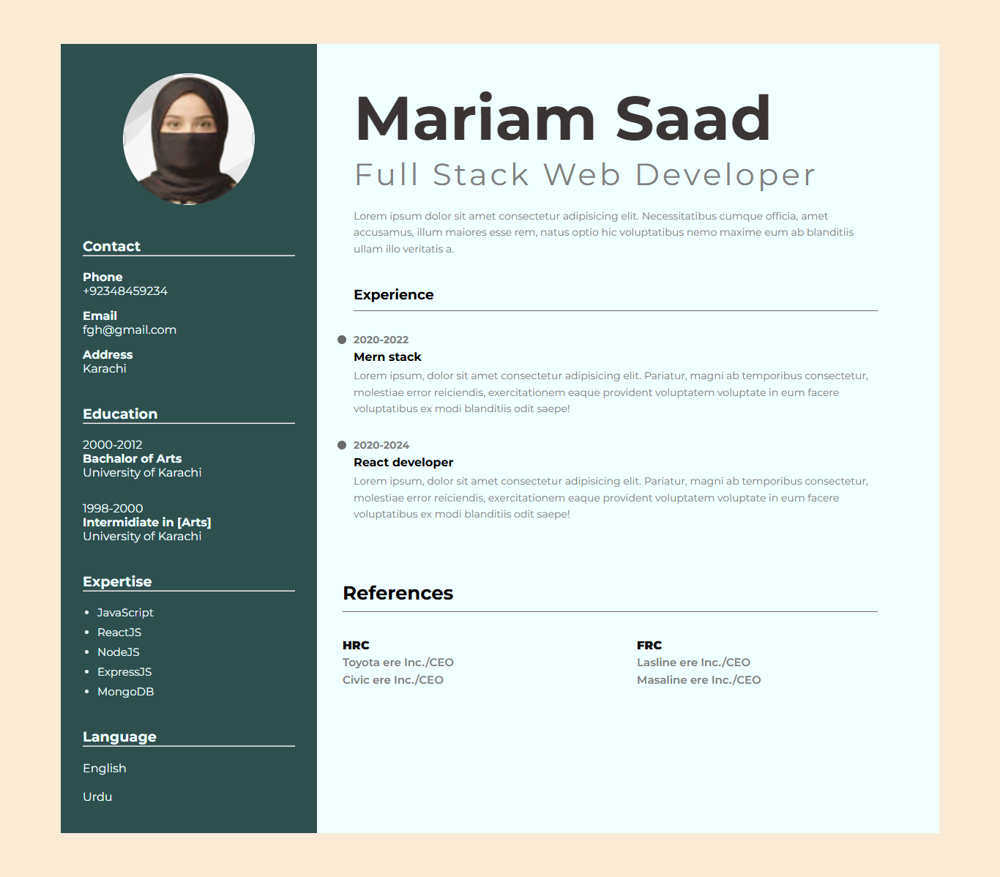

# MERN-STACK_with_GenAI 🚀

## 📖 About This Repository

Welcome to my MERN Stack and Generative AI learning journey.

This repository contains projects, exercises, notes, and practical implementations that I have developed while learning modern Full-Stack Web Development and Artificial Intelligence technologies.

The purpose of this repository is to document my progress, strengthen my development skills, and build a strong portfolio showcasing my growth as an aspiring AI and Full-Stack Developer.

---

# 🎯 Learning Objectives

* Build responsive and modern websites
* Master frontend development
* Learn backend development using Node.js and Express.js
* Work with databases using MongoDB
* Develop full-stack MERN applications
* Learn Git and GitHub workflows
* Explore Generative AI and Agentic AI concepts
* Integrate AI-powered features into web applications

---

# 🛠 Technologies Learned

## Frontend Development

### HTML5

* Semantic HTML
* Forms and Validation
* Accessibility Basics
* SEO-Friendly Structure

### CSS3

* Flexbox
* CSS Grid
* Responsive Design
* Animations & Transitions
* Media Queries

### Bootstrap 5

* Responsive Grid System
* Navigation Bars
* Cards
* Carousels
* Utility Classes

### JavaScript (ES6+)

* Variables and Scope
* Functions
* Arrays and Objects
* DOM Manipulation
* Events
* Fetch API
* Async/Await
* ES6 Modules

---

# ⚛ React Development

* Components
* JSX
* Props
* State Management
* Event Handling
* Conditional Rendering
* Lists & Keys
* React Hooks

  * useState
  * useEffect
* React Router

---

# 🌐 Backend Development

## Node.js

* Runtime Environment
* Modules
* NPM Package Management

## Express.js

* Routing
* Middleware
* REST APIs
* Error Handling

---

# 🗄 Database Development

## MongoDB

* Collections
* Documents
* CRUD Operations
* MongoDB Atlas

## Mongoose

* Schemas
* Models
* Validation
* Database Relationships

---

# 🔗 Version Control

## Git

* Repository Management
* Branching
* Merging
* Commit History

## GitHub

* Repository Hosting
* Pull Requests
* Collaboration Workflow
* Documentation

---

# 🤖 Generative AI Learning

### Topics Explored

* Introduction to Generative AI
* Prompt Engineering
* Large Language Models (LLMs)
* AI Agents
* Agentic Workflows
* OpenAI Ecosystem
* Google Gemini Ecosystem
* AI-Powered Applications

---

#  Featured Projects

# 📄 Modern Resume Website

A modern and professional Resume/CV webpage built using **HTML5** and **CSS3**. The project showcases personal information, education, skills, experience, and references in a clean two-column layout.

## 🚀 Features

* Professional Resume Layout

* Two-Column Design

  * Left Sidebar for Personal Information
  * Right Content Area for Professional Details

* Profile Section

  * Circular Profile Image
  * Personal Introduction

* Contact Information

  * Email Address
  * Contact Details

* Education Section

  * Academic Qualifications
  * Educational Timeline

* Skills & Expertise

  * Technical Skills
  * Professional Competencies

* Languages Section

  * Multiple Language Proficiency Display

* Professional Summary

  * Career Overview
  * Personal Description

* Experience Timeline

  * Timeline-Based Layout
  * Experience History Display
  * Visual Timeline Indicators

* References Section

  * Professional References
  * Contact Information Display

## 🎨 UI Features

* Modern Resume Design
* Responsive Flexbox Layout
* Google Fonts Integration
* Circular Profile Image
* Professional Color Scheme
* Timeline Visualization
* Section Dividers & Underlines
* Clean Typography
* Structured Content Organization

## 🛠 Technologies Used

* HTML5
* CSS3
* Flexbox
* Google Fonts

## 📚 Concepts Practiced

* Resume Web Design
* CSS Flexbox Layout
* Timeline Components
* Typography Styling
* Responsive Structure
* Image Styling
* Professional UI Design
* Two-Column Layout System

---

Created as part of my Frontend Web Development Learning Journey 🚀

### Image Here 📷 

# 🎓 Student Registration Form

A modern and responsive **Student Registration Form** built using **HTML5** and **CSS3**. This project demonstrates the implementation of advanced HTML form elements, semantic structure, user input validation, and modern CSS styling techniques.

---

## 📌 Project Overview

This project is designed to collect student information through an interactive registration form. It incorporates various HTML5 input types, form controls, fieldsets, and custom CSS styling to create a professional and user-friendly interface.

The design focuses on:

* Clean user experience
* Structured form organization
* Input validation
* Responsive layout
* Modern UI styling

---

# 🚀 Features Implemented

## 👤 Personal Information Section

The form collects basic user information including:

* First Name
* Last Name
* Email Address
* Password
* Phone Number
* Date of Birth

### HTML Concepts Used

* Text Input
* Email Input
* Password Input
* Number Input
* Date Picker
* Placeholder Attributes
* Required Validation

---

## 🎓 Education Details Section

Students can provide their academic background.

### Features

* Highest Qualification Selection
* Field of Study Selection
* Categorized Academic Options

### HTML Concepts Used

* `<select>`
* `<option>`
* `<optgroup>`
* Dropdown Menus

---

## 💻 Skills Selection

Students can choose their technical skills.

### Available Skills

* HTML5
* CSS3
* JavaScript
* ReactJS
* NodeJS

### HTML Concepts Used

* Checkboxes
* Multiple Selection Inputs

---

## 📁 Uploads & Preferences

This section allows users to provide additional preferences.

### Features

* File Upload
* Available Time Selection
* Experience Level Slider

### HTML Concepts Used

* File Input
* Time Input
* Range Slider

---

## 📝 Additional Information

Allows students to provide extra details.

### Features

* About Yourself Text Area
* Terms & Conditions Agreement

### HTML Concepts Used

* Textarea
* Checkbox Agreement

---

# 🎨 CSS Features Implemented

## Custom Typography

Google Fonts Integration:

* Playfair Display
* Montserrat
* Supermercado One

---

## Modern Visual Design

### Styling Techniques

* Background Image
* Glassmorphism Effect using `backdrop-filter`
* Rounded Corners
* Custom Button Styling
* Hover Transitions
* Custom Form Controls

---

## Form Enhancements

### Input Styling

* Custom Input Fields
* Customized Placeholder Text
* Styled Select Menus
* Styled File Upload Control
* Custom Textarea Design

---

## Browser Autofill Customization

Implemented custom styling for browser autofill fields using:

* `-webkit-autofill`
* Custom Background Colors
* Custom Text Colors

---

## Range Slider Styling

Customized experience level slider using:

* Accent Colors
* Smooth Transitions
* Improved User Interaction

---

## Layout Techniques

### CSS Properties Used

* Flexbox
* Margin & Padding Management
* Width Control
* Border Radius
* Box Shadow
* Background Cover

---

# 📚 HTML5 Concepts Practiced

✅ Form Creation

✅ Labels & Accessibility

✅ Input Validation

✅ Fieldsets & Legends

✅ Dropdown Menus

✅ Checkboxes

✅ File Upload

✅ Time Picker

✅ Range Slider

✅ Textarea

✅ Form Reset Functionality

---

# 📚 CSS3 Concepts Practiced

✅ Flexbox Layout

✅ Google Fonts

✅ Glassmorphism UI

✅ Custom Buttons

✅ Hover Effects

✅ Input Styling

✅ Placeholder Styling

✅ Box Shadows

✅ Background Images

✅ Responsive Width Management

✅ Browser Autofill Styling

---

# 🛠 Technologies Used

* HTML5
* CSS3
* Google Fonts

---

# 🎯 Learning Outcomes

Through this project, I learned:

* Building structured HTML forms
* Applying HTML5 validation
* Using advanced form controls
* Creating visually appealing interfaces with CSS
* Implementing Glassmorphism effects
* Customizing browser autofill behavior
* Styling user input elements professionally
* Organizing large forms using fieldsets and legends

---

# 📸 Project Type

Frontend Development Practice Project

Level: Beginner to Intermediate

Focus Area: HTML Forms & CSS Styling

---

## 🌟 Future Improvements

* Responsive Mobile Layout
* JavaScript Form Validation
* Form Submission Handling
* Backend Integration
* Database Storage
* Success/Error Notifications

---

### Developed as part of my Web Development Learning Journey 🚀

This README presents the project professionally and highlights **every HTML5 and CSS concept you practiced**, which is exactly what recruiters and GitHub visitors look for when reviewing learning repositories.

---

# 📚 Current Learning Roadmap

* Advanced JavaScript
* React Ecosystem
* Redux Toolkit
* Node.js APIs
* MongoDB Atlas
* Authentication & Authorization
* MERN Full-Stack Projects
* AI Agents Development
* Retrieval-Augmented Generation (RAG)
* Agentic AI Systems

---

# 🌱 Future Goals

* Build Production-Ready MERN Applications
* Develop AI-Powered Web Applications
* Learn Cloud Deployment
* Master Agentic AI Systems
* Contribute to Open Source Projects

---

# 🤝 Connect With Me

GitHub:
[https://github.com/mariam-2324](https://github.com/mariam-2324)

---
