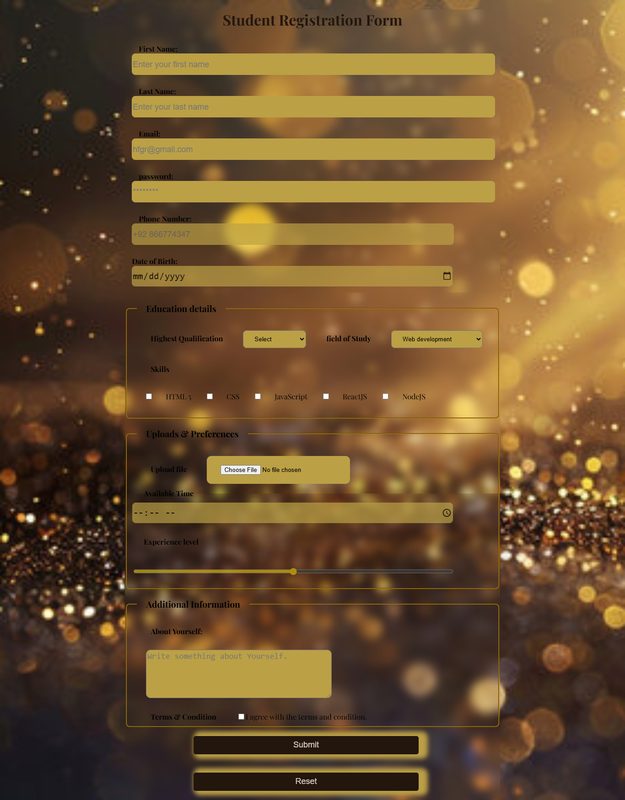

# 🎓 Complex Student Registration Form

Welcome to my **Complex Student Registration Form** project! This project represents a significant milestone in my journey toward mastering web development. I’ve transitioned from basic static forms to a fully functional, aesthetically pleasing, and professional-grade registration interface.

### 🎨 Project Overview

This form is designed to be more than just an input field—it’s an immersive experience. I focused on combining **Semantic HTML5** with modern **CSS3 styling** to create a user-friendly and visually stunning registration portal.

### 🛠️ Tech Stack & Key Features

* **HTML5:** Leveraged semantic tags to improve accessibility and structure.
* **CSS3:** Implemented modern styling, including the trending **Glassmorphism** effect.
* **Interactive UI:** Integrated diverse input types including checkboxes, range sliders, dropdowns, and file uploaders.

---

### 💡 Challenges Faced

Building this project wasn't without its hurdles:

* **Spacing & Layout:** One of the main challenges was managing the spacing between inputs and labels. I learned how to effectively use padding and margins to create a balanced, clean look.
* **Mastering New Inputs:** It was my first time implementing a wide variety of input types (range sliders, date/time pickers, and nested dropdowns) and ensuring they were fully styled to match the theme. It was a great learning curve!

### 🚀 What I Learned

This project was a deep dive into the following concepts:

**HTML Mastery:**

* **The `<fieldset>` & `<legend>` Tags:** I discovered how incredibly useful these are for grouping related information, providing a logical flow, and adding professional structural boundaries to the form.
* **Div Wrapping:** I learned the importance of wrapping inputs and labels in separate `div` containers to control the document flow and responsiveness.

**CSS Artistry:**

* **Glassmorphism:** I explored the power of `backdrop-filter: blur()`. Combining this with transparency against a vibrant background image creates a "frosted glass" look that is absolutely eye-catching. Watching the project come to life with this depth and transparency was a mind-blowing experience! 🌟

---

### Image Here 🖼️

### The Video 🎥
Watch here: [YouTube](https://youtu.be/4uqcWrfBIOw?si=U-TT6ls5ZUbfvCpH)

### 🏁 Conclusion

ALHUMDULLILAH, I am incredibly satisfied with the learning outcomes of this project. MASHA ALLAH, this experience has fueled my passion, and I am now ready to dive into even more complex projects to make them full of life and aesthetic beauty.

Thank you for checking out my work! Feel free to explore the code, suggest improvements, or clone this for your own projects. 🚀✨

---